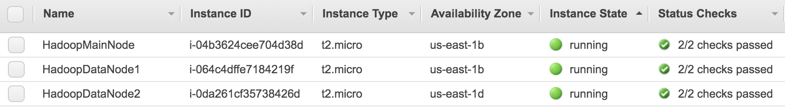

# hadoop-app

In this example I will be setting up an [Apache Hadoop](https://hadoop.apache.org/) Multi-node Cluster on [AWS](https://aws.amazon.com/) and processing a set of input text files using the Hadoop Streaming API and Python Mapper/Reducers. The simple application will perform the same task we saw in my [Spark App](https://github.com/spineo/spark-app) but instead use the Hadoop framework to output the alphabet letter counts.

The setup involves a main node and two data nodes and use Hadoop v2.10.0 available from one of the mirros at https://hadoop.apache.org/releases.html

## Launch the Instances

For this example, I will click on _Launch Instance_ and select an Amazon Linux t2.micro 64-bit (x86) configuration (Free tier eligible). For now I will not perform additional configurations of the instances, add storage, or attach any security group(s) but I will add a tag (under the _Add Tags_ section) with a key _Name_ for each of the three instances and values _HadoopMainNode_, _HadoopDataNode1_, and _HadoopDataNode2_ respectively. As I launch each instance I will be using a pre-existing key pair (i.e., certificate).

Once the instances are fully up and running you should be able to see them on the dashboard as shown in the screenshot below along with their Public DNS and IP (not shown). You should also be able to log on to any of these instances as _ec2-user_ from an SSH terminal using your private key or, since this feature is automatically enabled on Amazon Linux instances, using the EC2 Browser-based SSH connection.  



## Additional Setup for each Node (as _root_ user)

### Install Dependencies

* Java 1.8 JDK (java-1.8.0-openjdk.x86_64)
* Git (2.23.0) (optional)

### Hadoop Setup

#### Install the Application and Configure JAVA_HOME

* mkdir /var/applications

* wget hadoop (v.2.10.0): wget http://apache-mirror.8birdsvideo.com/hadoop/common/hadoop-2.10.0/hadoop-2.10.0.tar.gz or other mirror (from the https://hadoop.apache.org/releases page) and run _tar xvf hadoop-2.10.0.tar.gz_

* mv hadoop-2.10.0 hadoop

* Edit _/var/applications/hadoop/etc/hadoop/hadoop-env.sh_:
    Replace export JAVA_HOME=${JAVA_HOME} with export JAVA_HOME=/usr/lib/jvm/jre-1.8.0-openjdk
    
* Add to the  _/var/applications/hadoop/etc/hadoop/core-site.xml_ configuration as shown below:
```
<configuration>
  <property>
    <name>fs.defaultFS</name>
    <value><nnode>:9000</value>
  </property>
</configuration>
```
* mkdir -p /usr/local/hadoop/hdfs/data && chown -R hadoop.hadoop /usr/local/hadoop/hdfs/data

* Create the _hadoop_ user and run:
```
chown hadoop.hadoop /usr/local/hadoop/hdfs/data
chown -R hadoop.hadoop /var/applications
```
* Set up passwordless ssh for each node:
```
sudo su hadoop
cd ~
mkdir .ssh
chmod 700 .ssh && cd .ssh
ssh-keygen (run just on main node and just hit enter with each prompt)
```
* Copy the public key generated to the _~/.ssh/authorized_keys_ file (and ensure access permissions are set to 644!)

* Edit the _~/.ssh/config_ file (ensuring access permissions are set to 644 when done) to include the following:
```
Host MainNode
    HostName <HadoopMainNodeHost>
    User hadoop
    IdentityFile ~/.ssh/id_rsa

Host DataNode1
    HostName <HadoopDataNode1Host>
    User hadoop
    IdentityFile ~/.ssh/id_rsa

Host DataNode2
    HostName <HadoopDataNode2Host>
    User hadoop
    IdentityFile ~/.ssh/id_rsa
```

#### Setup the HDFS Properties on the Main Node

* Edit the /var/applications/hadoop/etc/hadoop/hdfs-site.xml file on the main node by adding the following configuration:
```
<configuration>
  <property>
    <name>dfs.replication</name>
    <value>3</value>
  </property>
  <property>
    <name>dfs.MainNode.name.dir</name>
    <value>file:///usr/local/hadoop/hdfs/data</value>
  </property>
</configuration>
```

#### Setup the MapReduce Properties on the Main Node

* Copy the /var/applications/hadoop/etc/hadoop/mapred-site.xml.template to _mapred-site.xml_ in the same directory and edit to include:
```
<configuration>
  <property>
    <name>mapreduce.jobtracker.address</name>
    <value><nnode><HadoopMainNodeHost>:54311</value>
  </property>
  <property>
    <name>mapreduce.framework.name</name>
    <value>yarn</value>
  </property>
</configuration>
```

#### Setup the YARN Properties on the Main Node

* Edit the _/var/applications/hadoop/etc/hadoop/yarn-site.xml_ to include the following:
```
<configuration>
  <!-- Site specific YARN configuration properties -->
  <property>
    <name>yarn.nodemanager.aux-services</name>
    <value>mapreduce_shuffle</value>
  </property>
  <property>
    <name>yarn.nodemanager.aux-services.mapreduce.shuffle.class</name>
    <value>org.apache.hadoop.mapred.ShuffleHandler</value>
  </property>
  <property>
    <name>yarn.resourcemanager.hostname</name>
    <value><HadoopMainNodeHost></value>
  </property>
</configuration>
```

#### Setup Master and Slaves on the Main Node

* Create a _/var/applications/hadoop/etc/hadoop/masters_ file and add the following:
```
<HadoopMainNodeHost>
```

Edit the  _/var/applications/hadoop/etc/hadoop/slaves_
```
<HadoopDataNode1Host>
<HadoopDataNode2Host>
```

#### Start the Hadoop Cluster

#### Format the HDFS File System on the Main Node
 ```
cd /var/applications
./hadoop/bin/hdfs namenode -format
```

#### Start the Hadoop Cluster
```
./hadoop/sbin/start-dfs.sh
./hadoop/sbin/start-dfs.sh
```

## Stop and Re-starting AWS Instances

_Note: If you stop/start any of the instances and have not set up a domain name you will need to update the public DNS in the following locations:_

* Main Node:
```
~/.ssh/config (references to main and data nodes updated)
/var/applications/hadoop/etc/hadoop/mapred-site.xml
/var/applications/hadoop/etc/hadoop/yarn-site.xml
/var/applications/hadoop/etc/hadoop/masters
/var/applications/hadoop/etc/hadoop/slaves
```
